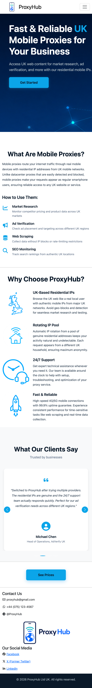
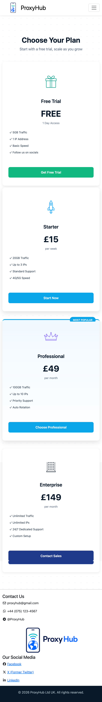
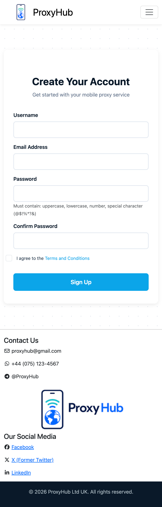

# ProxyHub - UK Mobile Proxy Service

Professional B2B website offering UK-based mobile proxies for market research, ad verification, and web scraping.

## Table of Contents
- [Live Site](#live-site)
- [User Stories](#user-stories)
- [Features](#features)
- [Screenshots](#screenshots)
- [Technologies](#technologies)
- [File Structure](#file-structure)
- [Deployment](#deployment)
- [Testing](#testing)
- [AI Usage](#ai-usage)
- [Credits](#credits)
- [Author](#author)

---

## Live Site
https://artem-builds.github.io/proxy-hub/

---

## User Stories

### 1. Homepage Hero (MVP)
**As a** business owner  
**I want to** immediately understand what mobile proxies are  
**So that** I can decide if this service fits my needs

**Acceptance Criteria:**
- Clear headline and explanation visible above the fold
- CTA button links to sign-up page
- Responsive layout on all devices

---

### 2. Pricing Table (MVP)
**As a** potential customer  
**I want to** see all pricing options clearly  
**So that** I can choose a plan within my budget

**Acceptance Criteria:**
- All 4 plans displayed with prices
- Features listed for each plan
- No hidden information

---

### 3. Contact Form (MVP)
**As a** user  
**I want to** submit my details easily  
**So that** I can get started with the service

**Acceptance Criteria:**
- Form includes all required fields
- Real-time validation shows errors
- Password strength requirements enforced
- Passwords must match
- Terms and conditions must be accepted

---

### 4. Navigation Menu (MVP)
**As a** visitor  
**I want to** navigate between pages easily  
**So that** I can find information quickly

**Acceptance Criteria:**
- Nav bar visible on all pages
- Links work correctly
- Active page highlighted
- Mobile menu functions properly

---

### 5. Benefits Section
**As a** business user  
**I want to** understand the advantages  
**So that** I can justify the purchase decision

**Acceptance Criteria:**
- 4 key benefits listed clearly
- Custom icons support each benefit
- Section visible on homepage

---

### 6. Testimonials Carousel
**As a** potential customer  
**I want to** read reviews from other clients  
**So that** I can trust the service quality

**Acceptance Criteria:**
- Carousel displays 4 testimonials
- Auto-rotates every 5 seconds
- Manual navigation with arrows and dots
- Responsive on mobile devices

---

## Features

### Homepage (index.html)
- **Hero Section:** Clear value proposition with CTA button
- **What Are Mobile Proxies:** Educational section explaining the service and use cases
- **Benefits Showcase:** 4 key benefits with custom icons (UK-based IPs, residential networks, 24/7 support, fast connections)
- **Testimonials Carousel:** Client reviews with auto-rotation and manual controls
- **CTA Section:** Call-to-action directing users to pricing page

### Pricing Page (pricing.html)
- **4 Pricing Tiers:** Free Trial, Starter, Professional (Most Popular), Enterprise
- **Custom Icons:** Unique icon for each plan
- **Feature Comparison:** Clear list of features for each tier
- **Dot Pattern Background:** Subtle visual interest
- **Responsive Cards:** Hover effects and mobile-optimized layout

### Sign Up Page (signup.html)
- **Registration Form:** Username, email, password fields
- **HTML5 Validation:** Email format checking
- **Password Strength:** Requires 8+ characters, uppercase, number, special character
- **Password Matching:** Confirms both passwords match
- **Terms & Conditions:** Modal window with full terms, required checkbox
- **Success Message:** Confirmation after successful registration
- **Responsive Design:** Mobile-friendly form layout

### Navigation & Footer
- **Sticky Navigation:** Fixed navbar with logo and page links
- **Mobile Menu:** Hamburger menu for small screens
- **Footer:** Contact information, social media links, logo
- **Copyright Section:** Standard footer bar

---

## Screenshots

### Desktop Views

#### Homepage

#### Pricing Page

#### Sign Up Form

### Mobile Views

#### Mobile Homepage

#### Mobile Pricing

#### Mobile Sign Up

---

## Technologies

- **HTML5** - Semantic markup structure
- **CSS3** - Custom styling with flexbox, transitions, animations
- **Bootstrap 5.3** - Responsive framework for layout and components
- **JavaScript** - Form validation and user interactions
- **Font Awesome 6.4** - Icons for UI elements
- **Google Fonts** - Poppins font family

---

## Testing

### Code Validation
- **HTML:** Validated using [W3C Markup Validator](https://validator.w3.org/)
  - index.html: ✓ Pass - No errors found
  - pricing.html: ✓ Pass - No errors found
  - signup.html: ✓ Pass - No errors found
- **CSS:** Validated using [W3C CSS Validator (Jigsaw)](https://jigsaw.w3.org/css-validator/)
  - style.css: ✓ Pass - No errors found

### Browser Testing
Tested and verified on:
- **Google Chrome** (latest) - Primary testing browser
- **Mozilla Firefox** (latest) - Full functionality confirmed
- **Safari** (latest) - Webkit rendering verified
- **Microsoft Edge** (latest) - Chromium compatibility confirmed

### Responsive Testing
Tested across multiple screen sizes:
- **Desktop:** 1920x1080, 1366x768 - Full layout with all features
- **Tablet:** 768x1024 (iPad) - 2-column layouts, collapsible navigation
- **Mobile:** 375x667 (iPhone), 414x896 (iPhone Plus) - Single column, touch-optimized

### Form Validation Testing
- Email format validation ✓
- Password strength requirements ✓
- Password matching ✓
- Terms and conditions checkbox ✓
- Success message display ✓
- Form reset after submission ✓

---

## Credits

- **Logo Design:** AI-generated using ChatGPT DALL-E
- **Custom Icons:** AI-generated with detailed prompts (mobile proxies, benefits, pricing tiers)
- **Hero Background:** AI-generated illustration with network/satellite theme
- **Bootstrap Framework:** [getbootstrap.com](https://getbootstrap.com/)
- **Font Awesome Icons:** [fontawesome.com](https://fontawesome.com/)
- **Google Fonts (Poppins):** [fonts.google.com](https://fonts.google.com/)

---

## Author

**Artem**  
AI Augmented FullStack Bootcamp - HTML/CSS/Bootstrap Individual Project  
May 2026

GitHub Repository: [github.com/artem-builds/proxy-hub](https://github.com/artem-builds/proxy-hub)

---

## License

This project is for educational purposes as part of a bootcamp assignment.