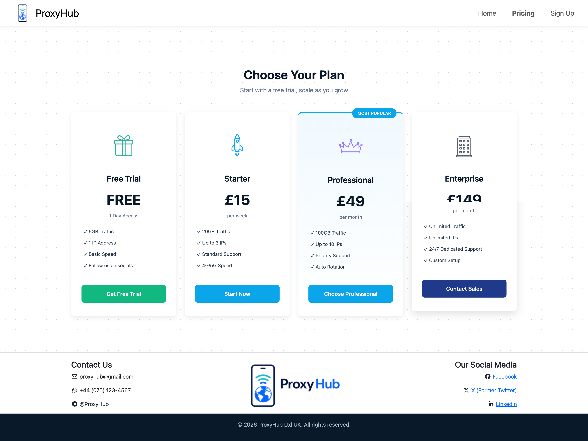
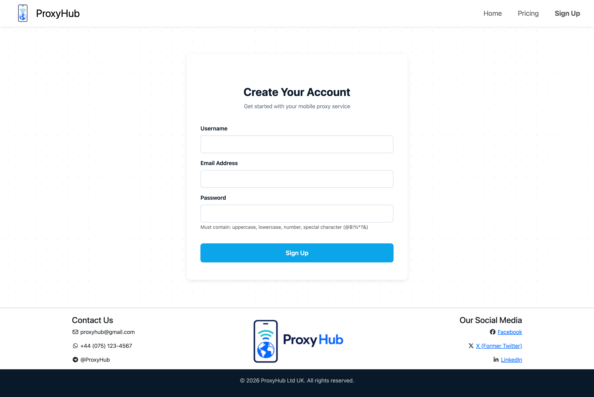

# ProxyHub - UK Mobile Proxy Service

Professional B2B website offering UK-based mobile proxies for market research, ad verification, and web scraping.

## Live Site
[Insert your deployment URL here]

## Features
- **Homepage:** Hero section, benefits showcase, CTA to pricing
- **Pricing Page:** 4 pricing tiers (Free Trial, Starter, Professional, Enterprise)
- **Sign Up:** Registration form with HTML5 validation
- **Responsive Design:** Mobile-first using Bootstrap 5.3

## Screenshots

### Homepage

### Pricing Page

### Sign Up Form

## Technologies
- HTML5
- CSS3
- Bootstrap 5.3
- Font Awesome

## Deployment
Platform: [GitHub Pages/Netlify/Vercel]  
Steps: Pushed to GitHub → Enabled Pages → Deployed

## Testing
- HTML/CSS validated with W3C validators
- Tested on Chrome, Firefox, Safari, Edge
- Responsive tested on desktop, tablet, mobile

## AI Usage
Used Claude AI for:
- Code generation (HTML, CSS, Bootstrap layouts)
- Debugging (CSS conflicts, responsive issues)
- Design suggestions (color schemes, layouts)

**Key learnings:** AI sped up development significantly, but required clear instructions and manual testing. Focused on requirements and design decisions while AI handled boilerplate code.

## Credits
- Bootstrap: getbootstrap.com
- Icons: AI-generated (ChatGPT/DALL-E)
- Fonts: Google Fonts (Poppins)

## Author
Artem Tkachenko - May 2026